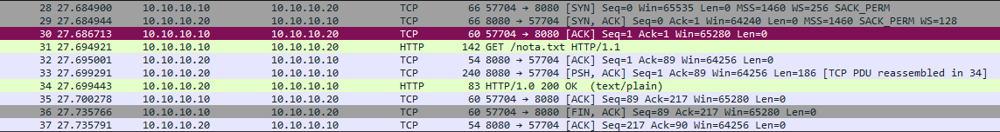
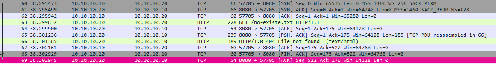

# Informe Técnico de Análisis de Tráfico de Red

**Máster SOC Analyst — Módulo 2: Networking · Ejercicio práctico de la sección 4**

- **Analista:** Carlos
- **Fecha del análisis:** 10 de septiembre de 2026
- **Clasificación:** Ejercicio de laboratorio — uso interno

---

## 1. Resumen ejecutivo

Se ha capturado y analizado tráfico de red generado de forma controlada en el laboratorio propio (red host-only `10.10.10.0/24`) con el objetivo de practicar el flujo completo de captura y análisis de paquetes: despliegue de un servicio HTTP de prueba, generación de tráfico legítimo y de ruido, captura con `tcpdump`, y disección con Wireshark.

Se han identificado y documentado dos conversaciones HTTP (una descarga válida y una petición a un recurso inexistente), el tráfico de ruido de fondo (ICMP, ARP, mDNS/SSDP), y una anomalía de configuración de red detectada durante el propio análisis: el origen ICMP no coincidía con la IP esperada del host, debido a que la interfaz host-only de UBUNTU-DESKTOP no tenía aplicada su configuración estática en el momento de la captura.

## 2. Objetivo del ejercicio

- Capturar tráfico real en el laboratorio con `tcpdump` y analizarlo con Wireshark.
- Identificar y aislar una conversación TCP concreta dentro de una captura con ruido de fondo, usando únicamente evidencia observable (sin asumir de antemano qué se había generado).
- Reconstruir el three-way handshake TCP con números de secuencia absolutos.
- Comparar una respuesta HTTP exitosa (200) con una fallida (404) a nivel de bytes.
- Practicar la escritura de filtros de visualización precisos en Wireshark.

## 3. Entorno y alcance

| Host | IP | Rol en el ejercicio |
|---|---|---|
| UBUNTU-SRV | 10.10.10.20 | Servidor HTTP de prueba (Python `http.server`, puerto 8080) y punto de captura con `tcpdump` |
| WIN11-CLIENT | 10.10.10.10 | Cliente que realiza la descarga real (`curl.exe` → `GET /nota.txt`) |
| UBUNTU-DESKTOP | 10.10.10.30 (nominal) | Genera tráfico de ruido (ping, petición 404) y estación de análisis con Wireshark |

Red: host-only `vboxnet0`, `10.10.10.0/24`, sin DHCP (IPs fijas manuales).
Fichero analizado: `modulo2-captura2.pcap` (144 paquetes, ventana de captura ≈ 65,8 s).

## 4. Metodología

1. Captura continua con `tcpdump` en UBUNTU-SRV, iniciada antes de generar cualquier tráfico, sobre la interfaz host-only:
   ```bash
   sudo tcpdump -i enp0s8 -w /tmp/modulo2-captura.pcap
   ```
2. Generación simultánea de tráfico: ping en bucle desde UBUNTU-DESKTOP (ruido ICMP), descarga real desde WIN11-CLIENT (`curl.exe` a `/nota.txt`), y una segunda petición desde UBUNTU-DESKTOP a un recurso inexistente (`/no-existe.txt`) para generar una respuesta 404 adicional.
3. Transferencia del pcap resultante a la estación de análisis (UBUNTU-DESKTOP) vía `scp`, apertura en Wireshark.
4. Análisis dirigido por evidencia: en ningún momento se asumió qué conversación era cuál sin confirmarlo primero por IP, puerto y contenido del stream.

## 5. Hallazgos

### 5.1 Inventario de tráfico capturado

| Protocolo | Nº de paquetes | Naturaleza |
|---|---|---|
| ICMP | 96 | Ruido — ping en bucle entre UBUNTU-DESKTOP y UBUNTU-SRV |
| TCP | 20 | 2 conversaciones HTTP (10 paquetes cada una) |
| UDP | 11 | Ruido — mDNS (puerto 5353) y SSDP (puerto 1900), descubrimiento de servicios propio del SO |
| ARP | 8 | Resolución de direcciones MAC entre hosts del segmento |
| IPv6 (sin decodificar) | 9 | Tráfico de vecinos/multicast IPv6, no relevante para este ejercicio |

De 144 paquetes totales, solo 20 (13,9 %) corresponden al tráfico realmente objeto del ejercicio; el resto es ruido de red legítimo. Esta proporción, aunque aquí es manejable a simple vista, ilustra a pequeña escala por qué en un SOC de producción el filtrado preciso no es opcional.

### 5.2 Conversaciones TCP identificadas

| Conversación | Puertos | Paquetes | Bytes | Resultado |
|---|---|---|---|---|
| WIN11-CLIENT → UBUNTU-SRV | 57704 → 8080 | 10 | 885 | 200 OK — descarga real de `nota.txt` |
| UBUNTU-DESKTOP → UBUNTU-SRV | 57705 → 8080 | 10 | 1.276 | 404 Not Found — recurso inexistente (ruido) |

### 5.3 Conversación principal: descarga de nota.txt

Identificada de forma inequívoca por IP de origen (`10.10.10.10`), puerto (`57704`) y contenido del stream HTTP:

```
GET /nota.txt HTTP/1.1
Host: 10.10.10.20:8080
User-Agent: curl/8.14.1
Accept: */*

HTTP/1.0 200 OK
Server: SimpleHTTP/0.6 Python/3.12.3
Content-type: text/plain
Content-Length: 29

contenido de prueba modulo 2
```

Three-way handshake (números de secuencia absolutos, no relativos):

| Paquete | Origen → Destino | Flags | Número de secuencia (ISN) |
|---|---|---|---|
| 28 | WIN11-CLIENT → UBUNTU-SRV | SYN | 75.428.707 |
| 29 | UBUNTU-SRV → WIN11-CLIENT | SYN, ACK | 768.304.218 (ack=75.428.708) |
| 30 | WIN11-CLIENT → UBUNTU-SRV | ACK | 75.428.708 (ack=768.304.219) |


*Figura 1 — Conversación TCP puerto 57704 (nota.txt): handshake, GET, respuesta 200 OK y cierre FIN/ACK.*

### 5.4 Comparativa: respuesta 200 OK vs 404 Not Found

| | 200 OK (nota.txt) | 404 (no-existe.txt) |
|---|---|---|
| Paquete | 34 | 66 |
| Content-Length | 29 bytes | 335 bytes |
| Interpretación | Cuerpo = contenido real, breve, del fichero de texto | Página de error HTML generada por el propio servidor, más pesada que el contenido válido |

**Conclusión de esta comparativa:** el tamaño de la respuesta no es indicador de éxito. La respuesta de error, al ser una página HTML, pesa más de 10 veces que el contenido real solicitado. Un analista que priorice por volumen de datos sin mirar el código de estado HTTP llegaría a una conclusión equivocada.


*Figura 2 — Conversación TCP puerto 57705 (no-existe.txt): mismo patrón de handshake, respuesta 404 File not found.*

### 5.5 Anomalía detectada: IP de origen inconsistente en el tráfico ICMP

Durante el filtrado del ruido ICMP se observó que la IP de origen de los paquetes echo-request generados desde UBUNTU-DESKTOP no era la esperada (`10.10.10.30`), sino `10.10.10.0` — la dirección de red del segmento `/24`, no una dirección de host válida.

**Causa raíz:** la captura se realizó antes de aplicar (`netplan apply`) la configuración de red estática ya presente en el fichero de netplan de UBUNTU-DESKTOP. La interfaz `enp0s3` no tenía la IP `10.10.10.30/24` activa en el momento de generar el tráfico, lo que resultó en un origen inválido a nivel de capa 3.

**Relevancia para el analista:** una dirección de red usada como IP de origen (último octeto `.0` en un `/24`) es una anomalía reconocible a simple vista y, en tráfico real de producción, sería motivo de investigación (posible spoofing, NAT mal configurado o, como en este caso, un host con la interfaz de red en un estado transitorio o mal aplicado). Se documenta aquí como hallazgo real del ejercicio y no como parte del guion original, precisamente el tipo de observación que un writeup profesional debe capturar aunque no estuviera buscándose.

## 6. Filtro de aislamiento

Filtro validado para aislar de una sola vez toda la conversación de la descarga real, excluyendo el ruido ICMP/ARP/UDP y la petición 404:

```
tcp.port == 57704
```

Resultado: 10 paquetes — coincide exactamente con el recuento de *Statistics → Conversations* para esa conversación, confirmando que el filtro no descarta ni añade paquetes de más.

## 7. Conclusiones y lecciones aprendidas

- La identificación de una conversación debe basarse en evidencia observable (IP, puerto, contenido del stream) y no en suposiciones sobre qué se generó — el ejercicio confirmó que es fácil confundir dos conversaciones TCP superficialmente similares (mismo puerto destino, mismo servidor) si no se verifica cada una por separado.
- Los números de secuencia relativos de Wireshark son una ayuda visual, no el dato real que viaja en el paquete; para cualquier análisis que dependa del ISN real (por ejemplo, detección de predicción de secuencia o técnicas de secuestro de sesión) hay que desactivar esa opción.
- El tamaño de una respuesta HTTP no correlaciona con su éxito — una página de error puede pesar más que el contenido válido solicitado.
- Una anomalía de red no buscada (IP de origen inválida) se detectó únicamente por revisar el tráfico de ruido con el mismo nivel de atención que el tráfico de interés, en vez de descartarlo sin más por considerarse irrelevante.
- `tcp.port` como filtro de aislamiento es más robusto que filtrar por el texto mostrado en columnas de resumen (como `_ws.col.info`), porque referencia un campo real del protocolo y captura la conversación completa en ambos sentidos.

## 8. Anexo — Filtros de Wireshark utilizados

| Filtro | Propósito |
|---|---|
| `tcp.port == 57704` | Aislar la conversación completa de la descarga real (nota.txt) |
| `tcp.port == 57705` | Aislar la conversación completa de la petición al recurso inexistente |
| `icmp` | Ver únicamente el tráfico de ruido ICMP |
| `ip.addr == 10.10.10.10 && ip.addr == 10.10.10.20 && tcp.port == 8080 && http` | Filtro combinado alternativo para la conversación HTTP objetivo |

---
*Documento generado como entregable del ejercicio práctico del Módulo 2 (Networking) del Máster SOC Analyst.*
